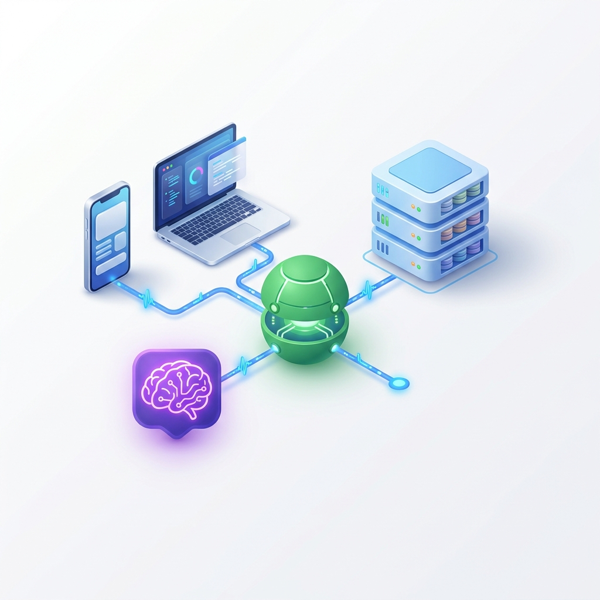

<p align="center">
  
</p>

<p align="center">
  
  &nbsp;
  
  &nbsp;
  
  &nbsp;
  
  &nbsp;
  
</p>

<h2>🛠️ Installation Steps:</h2>

<p>1. Clone the repository and install frontend dependencies</p>

```bash
npm install
```

<p>2. Run frontend</p>

```bash
npm run dev
```

<p>3. Install backend dependencies</p>

```bash
cd ayushayur-backend-master
npm install
```

<p>4. Run backend</p>

```bash
node server.js
```
<br>

<h2>📷 Project Screenshots:</h2>


 &nbsp;

<h2>⚙️ Architecture:</h2>


 &nbsp;

<h2>🚀 Future Enhancements:</h2>
<ul>
  <li>Implement advanced AI integration for deeper predictive healthcare analytics.</li>
  <li>Add comprehensive role-based access control and biometric authentication for secure access.</li>
  <li>Expand the mobile application views for remote tele-consultation support.</li>
</ul>
